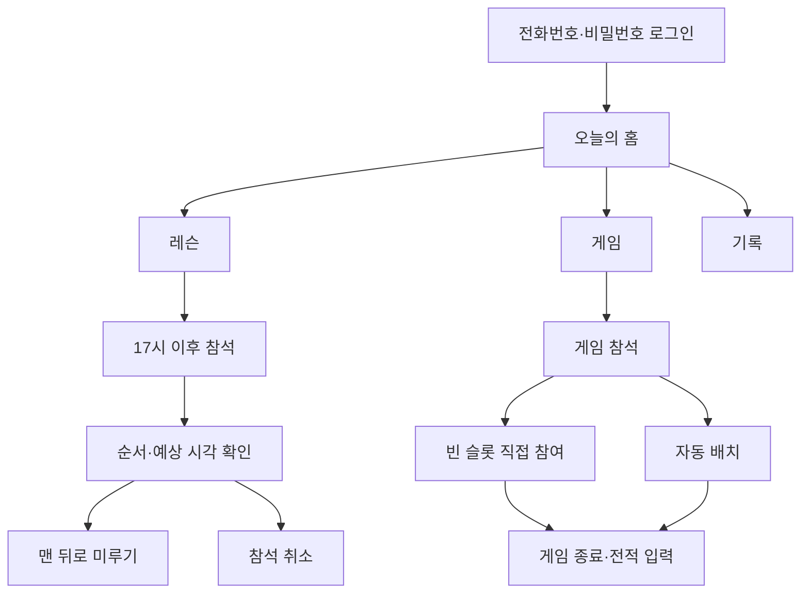
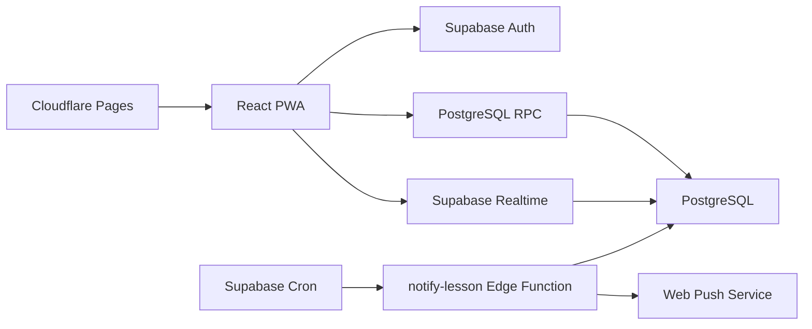

# ETRI 콕콕 PWA 설계

## 1. 문서 목적

ETRI 배드민턴 회원이 Android와 iPhone에서 같은 주소로 사용할 수 있는 설치형 웹 앱(PWA)의 MVP 설계를 정의한다.

핵심 목표는 다음과 같다.

- 코트 도착 순서대로 레슨 대기열 등록
- 15분 단위 예상 레슨 시각과 사전 알림
- 월별 레슨 참석 기록 조회
- 복식 게임 슬롯에 회원이 직접 참여
- 모든 참석자가 고르게 게임을 완료하도록 권고 순환 (완료해야 순환 반영)
- 구력, 누적 레슨 횟수, 성별을 고려한 별도 자동 배치
- 전적과 변경 이력을 서버에 저장하고 실시간 동기화

## 2. 확정 범위

### 플랫폼

- React, TypeScript, Vite 기반 PWA
- 모바일 우선 반응형 화면
- Android Chrome 및 iOS 16.4 이상 지원
- iPhone 푸시 알림은 홈 화면에 앱을 설치한 경우에만 지원

### 서버 및 호스팅

- 데이터베이스, 인증, 실시간 갱신, 서버 함수: Supabase
- 프런트엔드 정적 호스팅: Cloudflare Pages
- 예약 작업: Supabase Cron
- 푸시: 표준 Web Push와 VAPID

Supabase Free는 소규모 동호회 MVP에 적합하지만 500MB 데이터베이스, 50,000 MAU, 5GB egress 한도가 있고 장기간 비활동 프로젝트가 일시정지될 수 있다. 무료 서비스는 가용성 보장이 없으므로 정식 운영 규모가 커지면 유료 전환을 검토한다.

### 로그인

- 입력값: 휴대전화 번호, 비밀번호
- 신규 등록 시 이름 또는 닉네임을 추가로 입력한다.
- 실제 이메일 주소는 요구하지 않는다.
- 전화번호 원문은 저장하지 않고 서버 비밀값을 사용한 해시 식별자로 변환한다.
- 서버 함수가 비밀번호와 서버 비밀값을 조합해 Supabase Auth용 강한 내부 자격 증명을 만든다.
- 연속 로그인 실패 시 일시 잠금한다.
- 비밀번호 분실 시 동호회 관리자가 임시 비밀번호로 재설정한다.

## 3. 사용자와 권한

### 회원

- 프로필 입력 및 수정
- 당일 레슨 참석, 맨 뒤로 미루기, 취소
- 게임 참석 등록 및 취소
- 게임 슬롯 생성, 참여, 시작, 종료
- 자동 배치 실행 및 확정
- 전적 입력 및 수정
- 기록 조회

### 동호회 관리자

회원 권한을 모두 포함하고 다음 기능을 추가로 가진다.

- 회원 활성화/비활성화
- 비밀번호 재설정
- 잘못된 기록 복구

게임 운영 기능은 확정 요구사항에 따라 모든 활성 회원에게 허용한다. 데이터 변경은 `audit_logs`에 기록한다.

## 4. 주요 사용자 흐름

## 5. 레슨 규칙

### 세션과 참석

- 시간대는 `Asia/Seoul`로 고정한다.
- 당일 첫 참석 요청 시 레슨 세션을 자동 생성한다.
- 참석은 매일 17:00 이후에만 가능하다.
- 코치는 1명, 레슨 시간은 1인당 15분으로 고정한다.
- 서버의 `joined_at`을 사용해 도착 순서를 결정한다.
- 회원 한 명은 같은 날 활성 예약을 하나만 가질 수 있다.

### 예상 시각

- 첫 레슨 시작 시각은 `17:00`과 첫 참석 시각 중 늦은 시각이다.
- 진행 중인 레슨(시작 시각이 지났지만 15분 이내)은 시작 시각을 유지하고,
  다음 사람은 앞사람 종료 시각(남은 시간)부터 15분씩 이어 배정한다.
  예: 앞사람이 10분 진행 중이고 대기 2명이면 내 레슨은 5 + 15 + 15 = 35분 후.
- 예정 시각 + 15분이 지난 예약은 자동으로 `completed` 처리해 대기열에서 내린다.
- 앞사람이 빠지면 뒤 시각이 당겨지되, 현재 시각보다 이르게 잡지 않는다.
- 취소·미루기·시간 경과 시 서버 트랜잭션(`resequence_lesson_queue`)에서 전체를 다시 계산하며,
  매분 알림 크론에서도 동기화한다.
- 예상 시각이 변경되면 Supabase Realtime으로 즉시 갱신한다.

### 변경과 취소

- 순서를 임의로 앞당기는 기능은 제공하지 않는다.
- `맨 뒤로 미루기`는 새로운 서버 시각을 부여해 현재 대기열 끝으로 이동한다.
- 취소는 실제 삭제가 아닌 `cancelled` 상태로 변경한다.
- 이미 시작 또는 완료한 레슨은 일반 회원이 취소할 수 없다.

### 알림

- 3종 알림을 보낸다: 15분 전 "레슨 15분 전입니다", 5분 전 "곧 레슨이 시작됩니다",
  예상 시각이 1분 이상 바뀌면 "레슨 예상 시간 변경".
- 등록 시점에 이미 15분 이내라면 15분 전 알림은 건너뛰고 가능한 다음 알림부터 보낸다.
- 알림 로그의 (예약, 구독, 종류, 예정 시각) 고유 키로 중복 발송을 막고,
  시각이 바뀌면 옛 시각 기준 대기 알림을 지우고 새 시각으로 다시 만든다.
- iPhone/iPad는 홈 화면에 추가한 앱에서만 푸시를 켤 수 있으며, 앱이 상황별 안내 문구를 보여 준다.
- 푸시 권한이 없으면 앱 안의 배너와 예상 시각 표시를 유지한다.

### 월별 횟수

- 현재 달의 취소되지 않은 참석 건수를 기본 통계로 표시한다.
- 추후 정확한 코치 확인이 필요해지면 `completed` 상태만 집계하도록 설정할 수 있다.

## 6. 게임 규칙

### 게임 데이와 참석

- 날짜별 `game_day`를 첫 참석 시 자동 생성한다.
- 회원은 먼저 게임 참석 상태를 활성화해야 슬롯에 참여할 수 있다.
- 참석 취소 시 열려 있거나 진행 중인 슬롯에 포함되어 있으면 취소할 수 없다.
- 신규 참석자는 현재 순환에 즉시 참여할 수 있다.

### 복식 슬롯

- 한 슬롯의 정원은 4명이다.
- 모든 회원이 슬롯을 만들 수 있다.
- 회원은 열린 슬롯의 `게임 참여` 버튼으로 직접 자리를 선택한다.
- 한 회원이 둘 이상의 열린/진행 중 슬롯에 동시에 참여할 수 없다.
- 네 번째 회원이 들어오면 슬롯을 시작할 수 있다.
- 정원 검사, 중복 검사, 순환 검사는 하나의 데이터베이스 함수에서 원자적으로 수행한다.

### 순환 권고

`game_days.current_cycle`과 `game_attendances.last_joined_cycle`을 사용한다.
순환은 강제가 아니라 권고이며, 날짜별 `game_day`가 새로 만들어지므로 매일 1회부터 다시 시작한다.

1. 참석 등록 시 `last_joined_cycle`은 현재 순환보다 작은 값으로 시작한다.
2. `last_joined_cycle < current_cycle`인 회원은 `차례` 상태로 표시된다.
3. 자기 차례가 아니어도 참여할 수 있다. 다만 이미 이번 순환에서 게임을 마친 경우
   "현재 N번째 게임 참여입니다. (현재 순환 M회)" 안내와 함께 재확인을 받는다.
4. 순환 반영은 게임을 **완료(점수 입력)** 한 시점에만 일어난다.
   참여, 자동 배치 생성, 슬롯 나가기, 게임 삭제는 순환 상태를 바꾸지 않는다.
5. 활성 참석자 모두가 현재 순환에서 게임을 한 번 완료하면 `current_cycle`을 1 증가시킨다.
6. 인원이 4의 배수가 아니어도 남은 자리를 이미 완료한 회원이 채울 수 있다.
7. 자동 배치는 공정성을 위해 아직 이번 순환을 완료하지 않은 회원만 후보로 선택한다.

### 코트와 게임 관리

- 코트는 `코트 A`, `코트 B`, `코트 C` 세 면으로 고정하며 화면의 배치도에서 눌러 선택한다.
- 코트 A는 레슨 코트로, 선택 시 "이 코트는 레슨 코트입니다. 레슨이 없는 경우에만 사용 가능합니다." 확인을 받는다.
- 같은 코트에 열린/진행 중 게임이 있으면 새 게임을 만들 수 없다.
- 배치도는 비어 있는 코트를 초록색, 모집 중인 코트를 주황색, 게임 중인 코트를 회색과 `게임중` 표기·경과 시간으로 보여 준다.
- 열린/진행 중 게임은 재확인 후 삭제할 수 있다. 완료 전에는 순환에 반영된 것이 없으므로
  삭제해도 참여자의 순환 상태는 변하지 않고, 곧바로 다른 게임에 참여할 수 있다.

### 자동 배치

자동 배치는 수동 참여와 분리된 기능이며 외부 생성형 AI를 사용하지 않는다.

- 후보 우선순위: 현재 순환 참여 가능 여부, 적은 게임 수, 긴 대기시간
- 실력 점수: 구력 개월 수와 앱 이전/이후 누적 레슨 횟수의 정규화 점수
- 팀 구성: 가능한 조합 중 두 팀의 실력 점수 합 차이가 가장 작은 조합
- 성별: 선택 입력이며 혼복 선호가 켜진 경우 팀 구성 균형에만 사용
- 결과 화면에는 선택 이유와 팀별 예상 점수를 표시
- 사용자가 확정해야 실제 슬롯과 참여 기록이 생성

### 전적

- 슬롯 종료 후 A팀과 B팀 점수를 입력한다.
- 동점은 허용하지 않는다.
- 점수에서 승리 팀과 회원별 승/패를 계산한다.
- 같은 팀이었던 파트너별 전체 게임 수, 승리·패배 횟수, 승률을 집계한다.
- 수정 전 값은 감사 로그에 남긴다.

## 7. 화면 설계

### 공통 내비게이션

- 홈
- 레슨
- 게임
- 커뮤니티
- 기록
- 내 정보

### 로그인/가입

- 휴대전화 번호
- 비밀번호
- 신규 등록용 이름 또는 닉네임
- 기존 회원 로그인과 신규 회원 가입 모드

### 홈

- 현재 레슨 순서와 예상 시각
- 이번 달 레슨 참석 횟수
- 게임 참석 상태와 현재 순환
- 다음 행동으로 이동하는 큰 버튼
- PWA 설치 및 알림 허용 안내

### 레슨

- 참석/미루기/취소 버튼
- 내 순서와 예상 시각 강조
- 전체 대기열과 상태
- 15분 단위 타임라인

### 게임

- 참석 상태와 현재 순환
- 코트 배치도(코트별 상태·경과 시간·코트 선택)
- 열린/진행/완료 슬롯과 게임 삭제
- 당일 참석자 목록(사진·이름·구력)과 회원 상세(전적)
- 자동 배치 후보와 A/B팀 미리보기

### 커뮤니티

- 전체 회원 목록과 회원 상세(전적)
- 공지사항(관리자 작성, 홈에 최신 2건 노출)
- 외부게임 매칭 게시판(모든 회원 작성)

### 기록

- 내 기록: 레슨 월별 건수, 최근 게임 점수, 개인 승/패, 파트너별 전적
- 개인 랭킹: 동호회 전체 회원을 승수 → 승률 순으로 정렬 (상위 3명 메달 표시)
- 팀 랭킹: 같은 팀으로 뛴 2인 조합별 전적을 승수 → 승률 순으로 정렬

### 내 정보

- 프로필 사진 등록(Supabase Storage `avatars` 버킷)
- 닉네임
- 성별 또는 미지정
- 구력 개월 수
- 앱 사용 전 누적 레슨 횟수
- 푸시 알림 상태
- 로그아웃

## 8. 디자인 원칙

- 흰색 배경을 중심으로 네이비 주색상과 오렌지 강조색을 사용
- 로그인 패널은 배드민턴 배경 이미지가 은은하게 보이는 반투명 표면으로 구성
- ETRI 로고는 공통 헤더와 인증 화면에, 캐릭터는 홈 배너와 주요 상태 카드에 절제해 사용
- 결과와 주의 상태는 색상뿐 아니라 아이콘과 문구로 구분
- 최소 44px 터치 영역
- 핵심 숫자와 시간은 큰 글자로 표시
- 시스템 한글 글꼴을 사용해 로딩과 가독성을 개선
- 좁은 모바일 화면에서는 카드 한 열, 넓은 화면에서는 두 열
- 동작 중에는 버튼을 비활성화해 중복 요청 방지

## 9. 시스템 구조

프런트엔드는 공개 가능한 Supabase URL과 anon key만 사용한다. 서비스 역할 키, 전화번호·비밀번호 변환 비밀값, VAPID private key는 Supabase Edge Function secret에만 저장한다.

## 10. 데이터 모델

### `clubs`

- `ETRI 콕콕` 단일 동호회 기본 정보
- 내부 식별 코드 `ETRI`
- 생성자

### `members`

- `auth.users`와 1:1 연결
- 동호회, 닉네임, 역할, 활성 상태
- 성별, 구력 개월, 앱 사용 전 레슨 횟수

### `lesson_sessions`

- 동호회와 날짜
- 시작 시각, 15분 단위, 상태

### `lesson_bookings`

- 세션, 회원, 서버 참석 시각
- 순번, 예상 시작 시각
- `waiting`, `completed`, `cancelled` 상태

### `game_days`

- 동호회와 날짜
- 현재 순환 번호

### `game_attendances`

- 게임 데이와 회원
- 활성 상태, 마지막 참여 순환
- 게임 수와 마지막 게임 시각

### `game_slots`

- 게임 데이, 코트 이름
- `open`, `playing`, `completed`, `cancelled` 상태
- `manual`, `auto` 생성 방식

### `game_slot_players`

- 슬롯, 회원, 팀 A/B
- 참여 당시 순환 번호
- 참여 시각

### `game_results`

- 슬롯별 A팀/B팀 점수
- 승리 팀, 입력자, 수정 시각

### `push_subscriptions`

- 회원별 브라우저 Push API 구독
- endpoint와 암호화 키

### `notification_logs`

- 예약과 예정 시각별 발송 여부
- 중복 방지 및 오류 내용

### `login_attempts`

- 로그인 식별자 해시
- 실패 횟수와 잠금 만료 시각

### `posts`

- 공지(`notice`)와 외부게임 매칭(`matching`) 글
- 작성자, 제목, 내용
- 공지 작성은 관리자, 삭제는 작성자 또는 관리자

### `audit_logs`

- 변경 테이블, 레코드, 작업자
- 변경 전후 JSON

## 11. 데이터 보안

- 모든 업무 테이블에 Row Level Security를 적용한다.
- 활성 회원은 자신의 동호회 데이터만 읽을 수 있다.
- 프로필 수정은 본인으로 제한한다.
- 게임 관련 생성/수정은 같은 동호회의 활성 회원에게 허용한다.
- 관리자 작업은 서버 함수에서 역할을 다시 검사한다.
- 모든 원자적 업무 함수는 `auth.uid()`를 기준으로 동작하며 임의 회원 ID를 신뢰하지 않는다.
- 브라우저 콘솔이나 저장소에 전화번호 원문, 비밀번호, 서비스 역할 키, VAPID private key를 기록하지 않는다.
- 로그인 오류는 계정 존재 여부를 구분하지 않는 공통 문구로 표시한다.

## 12. 실패 및 예외 처리

- 동시에 네 번째 자리를 누르면 먼저 커밋된 한 명만 성공한다.
- 다른 기기에서 순서가 바뀌면 최신 서버 값을 다시 표시한다.
- 네트워크가 끊긴 상태에서는 읽기용 앱 셸만 제공하고 예약 쓰기는 온라인 복구 후 재시도하도록 안내한다.
- 푸시 전송 실패가 예약 자체를 실패시키지 않는다.
- 탈퇴 또는 비활성 회원의 과거 기록은 통계 보존을 위해 삭제하지 않는다.
- 무료 Supabase 프로젝트가 일시정지되면 복구 후 다시 연결해야 할 수 있음을 운영 문서에 표시한다.

## 13. 테스트 전략

- 레슨 순서 및 15분 시각 계산 단위 테스트
- 미루기/취소 후 전체 재정렬 테스트
- 게임 슬롯 동시 참여와 정원 초과 테스트
- 참석자 수 4, 5, 6, 7명 순환 경계 테스트
- 자동 배치의 후보 우선순위와 팀 실력 차 최소화 테스트
- 다른 동호회 접근 차단 RLS 테스트
- PWA manifest와 service worker 빌드 검사
- Android Chrome 및 iOS 홈 화면 설치 수동 검사

## 14. 배포 및 환경 변수

프런트엔드 공개 환경 변수:

- `VITE_SUPABASE_URL`
- `VITE_SUPABASE_ANON_KEY`
- `VITE_VAPID_PUBLIC_KEY`

Supabase Edge Function secret:

- `SUPABASE_SERVICE_ROLE_KEY`
- `AUTH_PEPPER`
- `VAPID_PUBLIC_KEY`
- `VAPID_PRIVATE_KEY`
- `VAPID_SUBJECT`

원격 연결은 Supabase와 Cloudflare 계정 인증 후 수행한다. 저장소에는 실제 키를 커밋하지 않고 `.env.example`만 제공한다.

## 15. MVP 완료 기준

- 동일 URL에서 Android와 iPhone이 동작하고 홈 화면에 설치할 수 있다.
- 레슨 참석, 미루기, 취소, 예상 시각, 월별 횟수가 서버에 저장된다.
- 15분 전·5분 전·시간 변경 푸시 또는 권한 미허용 시 인앱 안내가 동작한다.
- 게임 참석, 수동 슬롯 참여, 권고 순환(완료 기준), 자동 배치, 전적 입력이 동작한다.
- 동시 요청에도 레슨 순서와 게임 정원이 깨지지 않는다.
- 새로고침 또는 다른 기기 접속 후에도 기록을 다시 불러올 수 있다.
- 다른 동호회 데이터와 서버 비밀값에 접근할 수 없다.
